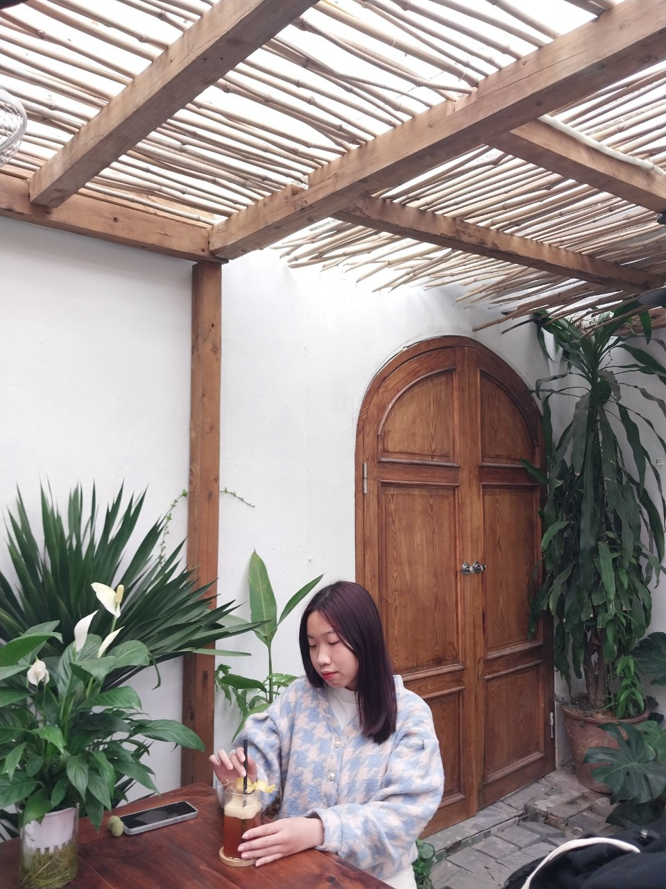

<!DOCTYPE html>
<html lang="en">
    <head>
        <title>Bùi Phương Thảo- Personal Website</title>
        <meta charset="utf-8">
        <meta name="viewport" content="width=device-width, initial-scale=1.0">
        <link rel="stylesheet" href="CSS/Styles.css">
        <!-- -->

    </head>
    <body>
        <header>
            

                    
            

            

                <h2>Bùi Phương Thảo</h2>
                
♡ Be where your feet are ♡

            

            <nav class="main-menu">
                <ul>
                    <li><a style= "color:#000000;" href ="#home"> Home </a> </li>
                    <li><a style= "color:#000000;" href="#about" >About </a></li>
                    <li><a style= "color:#000000;" href="#portfolio" >Portfolio  </a></li>
                    <li><a style= "color:#000000;" href="#contact" > Contact </a></li>
           
                </ul> 
            </nav>
        </header>
        <main>
            <section id="home">
                

                    <h2>Welcome to My Personal Website </h2>
                    
Explore my work and learn more about me.

                

            </section>
            <section id="about">
                

                    <h2>About me</h2>
                    
Insert your about me content here.

                

            </section>
            <section id="portfolio">
                

                    <h2>Portfolio </h2>
                    
Showcase your projects and works.

                

            </section>
            <section id="contact">
                

                    <h2>Contact Me</h2>
                    
Provide ways for visitors to get in touch with you.

                

            </section>
        </main>
        <footer>
            

                
&copy 2023 Bùi Phương Thảo. All rights reversed

            

        </footer>
    </body>
</html>
